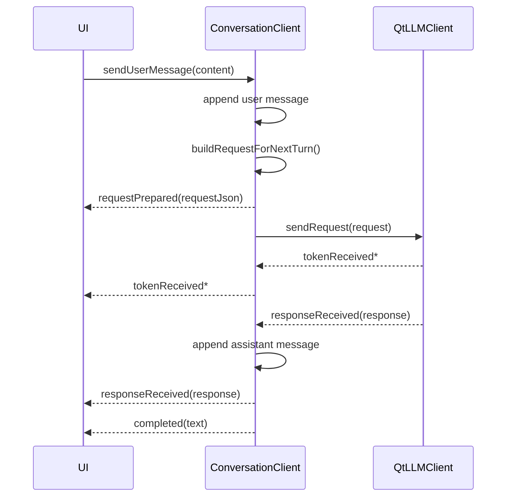

# `ConversationClient`

## 1. 定位

`ConversationClient` 是面向会话型应用的核心类。它建立在 `QtLLMClient` 之上，增加了：

- client 级身份
- session 管理
- 历史消息管理
- profile 注入
- 与工具循环上下文的绑定

如果你的应用是聊天窗口、会话页、多轮对话面板，通常应优先使用 `ConversationClient`。

## 2. 头文件与命名空间

- 头文件：`src/qtllm/chat/conversationclient.h`
- 命名空间：`qtllm::chat`

## 3. 接口签名总览

```cpp
QString uid() const;

void setConfig(const LlmConfig &config);
LlmConfig config() const;

void setProvider(std::unique_ptr<ILLMProvider> provider);
bool setProviderByName(const QString &providerName);
void setToolCallOrchestrator(
    const std::shared_ptr<tools::runtime::ToolCallOrchestrator> &orchestrator);

void setProfile(const profile::ClientProfile &profile);
profile::ClientProfile profile() const;

QString activeSessionId() const;
QString createSession(const QString &title = QString());
bool switchSession(const QString &sessionId);
QStringList sessionIds() const;
QString sessionTitle(const QString &sessionId) const;

void setHistory(const QVector<LlmMessage> &history);
QVector<LlmMessage> history() const;
void clearHistory();

void sendUserMessage(const QString &content);
void sendUserMessageWithTools(const QString &content,
                              const QJsonArray &tools,
                              const QString &traceId = QString());

ConversationSnapshot snapshot() const;
void restoreFromSnapshot(const ConversationSnapshot &snapshot);
```

## 4. 关键相关类型

`ConversationClient` 常用到的消息模型：

```cpp
struct LlmMessage {
    QString role;
    QString content;
    QString name;
    QString toolCallId;
    QVector<LlmToolCall> toolCalls;
};
```

`role` 常见值：

- `system`
- `user`
- `assistant`

## 5. 主要方法说明

### `uid() const`

作用：

- 返回当前 client 唯一标识

用途：

- 持久化
- 日志和 trace 上下文
- 多 client 管理

### `setConfig(...)` / `config() const`

作用：

- 管理当前会话使用的 Provider 配置

### `setProfile(...)` / `profile() const`

作用：

- 设置当前 client 的 profile

影响范围：

- system prompt
- persona
- thinking style
- memory policy

### `createSession(...)`

作用：

- 新建 session
- 自动设为当前 active session

返回值：

- 新建 `sessionId`

### `switchSession(...)`

返回值：

- `true`
  - 切换成功，或目标已是当前 session
- `false`
  - `sessionId` 为空或不存在

### `setHistory(...)` / `history() const` / `clearHistory()`

作用：

- 直接管理当前 active session 的消息历史

### `sendUserMessage(...)`

作用：

- 发送普通用户消息

### `sendUserMessageWithTools(...)`

作用：

- 发送带 tools schema 的用户消息

参数说明：

- `content`
  - 用户本轮输入
- `tools`
  - 当前轮暴露给模型的 tools schema
- `traceId`
  - 不传则自动生成

### `snapshot()` / `restoreFromSnapshot(...)`

作用：

- 导出和恢复完整会话快照

## 6. 请求构造规则

`ConversationClient` 内部通过 `buildRequestForNextTurn(...)` 构造请求，顺序大致为：

1. system prompt
2. persona
3. thinking style
4. tools schema
5. history window

history window 长度由 `profile.memoryPolicy.maxHistoryMessages` 控制。

## 7. session 与 history 模型

当前模型：

- 一个 `ConversationClient` 对应一个 `clientId`
- 一个 `clientId` 下可以有多个 session
- 同一时刻只有一个 active session
- `history()` 只返回当前 active session 历史

## 8. 发送消息时序



## 9. 信号

```cpp
void tokenReceived(const QString &token);
void reasoningTokenReceived(const QString &token);
void completed(const QString &text);
void responseReceived(const LlmResponse &response);
void errorOccurred(const QString &message);
void requestPrepared(const QString &payloadJson);
void providerPayloadPrepared(const QString &url, const QString &payloadJson);
void historyChanged();
void sessionsChanged();
void activeSessionChanged(const QString &sessionId);
void configChanged();
void profileChanged();
```

最常用组合：

- UI 内容刷新
  - `tokenReceived`、`completed`
- 会话列表刷新
  - `sessionsChanged`、`activeSessionChanged`
- 历史消息刷新
  - `historyChanged`
- 请求调试
  - `requestPrepared`、`providerPayloadPrepared`

## 10. 与 `QtLLMClient` 的区别

`QtLLMClient` 关注：

- 请求生命周期
- Provider
- 流式返回
- tool loop 执行

`ConversationClient` 关注：

- client/session
- history
- profile
- 把一次用户输入组织成下一轮请求

结论：

- `QtLLMClient` 更像底层执行器
- `ConversationClient` 更像会话编排器
