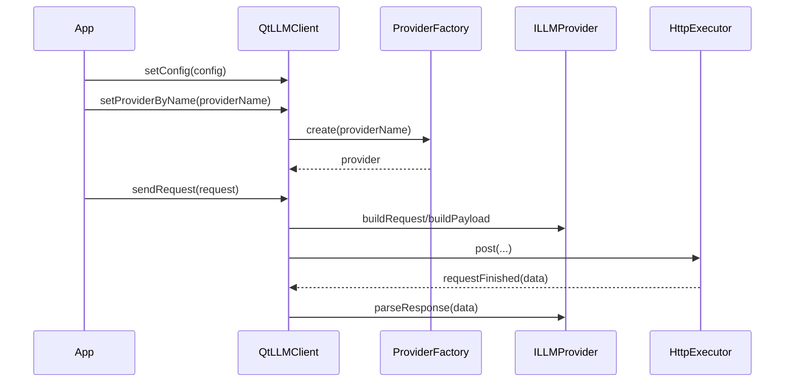

# Provider 体系

## 1. 定位

Provider 体系负责把统一的 `LlmRequest` / `LlmResponse` 模型映射到不同模型服务的实际协议。

当前工程的原则是：

- 应用层不要自己拼厂商协议 JSON
- 厂商差异收敛在 `ILLMProvider` 及其实现中

## 2. 核心接口：`ILLMProvider`

- 头文件：`src/qtllm/providers/illmprovider.h`
- 命名空间：`qtllm`

### 接口签名

```cpp
class ILLMProvider {
public:
    virtual ~ILLMProvider() = default;

    virtual QString name() const = 0;
    virtual void setConfig(const LlmConfig &config) = 0;

    virtual QNetworkRequest buildRequest(const LlmRequest &request) const = 0;
    virtual QByteArray buildPayload(const LlmRequest &request) const = 0;
    virtual LlmResponse parseResponse(const QByteArray &data) const = 0;

    virtual QList<QString> parseStreamTokens(const QByteArray &chunk) const = 0;
    virtual QList<LlmStreamDelta> parseStreamDeltas(const QByteArray &chunk) const;

    virtual bool supportsStructuredToolCalls() const;
};
```

### 方法职责

- `name()`
  - 返回 Provider 逻辑名称
- `setConfig(...)`
  - 接收 `LlmConfig`
- `buildRequest(...)`
  - 生成 URL 与 Header
- `buildPayload(...)`
  - 生成最终 payload JSON
- `parseResponse(...)`
  - 解析完整响应
- `parseStreamTokens(...)`
  - 解析基础流式 token
- `parseStreamDeltas(...)`
  - 解析更丰富的流式 delta，默认会把 token 映射成 `content` 通道
- `supportsStructuredToolCalls()`
  - 说明是否支持结构化工具调用

## 3. `ProviderFactory`

- 头文件：`src/qtllm/providers/providerfactory.h`

```cpp
class ProviderFactory {
public:
    static std::unique_ptr<ILLMProvider> create(const QString &providerName);
};
```

作用：

- 按逻辑名称创建具体 Provider

最常见调用：

```cpp
client->setProviderByName(QStringLiteral("openai-compatible"));
```

## 4. 当前主要 Provider

### `OpenAIProvider`

定位：

- 面向 OpenAI `/responses`

适合：

- 直接使用 OpenAI 风格新响应接口的场景

### `OpenAICompatibleProvider`

定位：

- 面向 `/chat/completions`

适合：

- Ollama
- LM Studio 风格服务
- 其他兼容 OpenAI 聊天接口的服务

### `OllamaProvider`

定位：

- 显式保留的 Ollama Provider 入口

### `VllmProvider`

定位：

- 显式保留的 vLLM Provider 入口

## 5. Provider 选择建议

### 本地模型服务

优先考虑：

- `openai-compatible`
- `ollama`
- `vllm`

### 云端 OpenAI 路径

优先考虑：

- `openai`

### 多供应商兼容模式

优先考虑：

- `openai-compatible`

## 6. 典型接入代码

```cpp
qtllm::LlmConfig config;
config.providerName = QStringLiteral("openai-compatible");
config.baseUrl = QStringLiteral("http://127.0.0.1:11434");
config.model = QStringLiteral("qwen2.5:7b");
config.stream = true;

client->setConfig(config);
client->setProviderByName(config.providerName);
```

## 7. 运行时链路



## 8. 新增一个 Provider 的实现要求

后续扩展新 Provider 时，至少应保证：

1. 正确实现 `ILLMProvider`
2. 正确处理 `LlmConfig`
3. 正确构建 URL、Header 和 payload
4. 正确解析完整响应与流式响应
5. 在 `ProviderFactory` 中注册入口
6. 不把厂商协议细节泄露到 UI 层

## 9. 调试建议

定位 Provider 问题时优先看：

1. `providerPayloadPrepared`
2. `errorOccurred`
3. `QtLlmLogger`
4. `toolsinside` 中对应 request artifact
