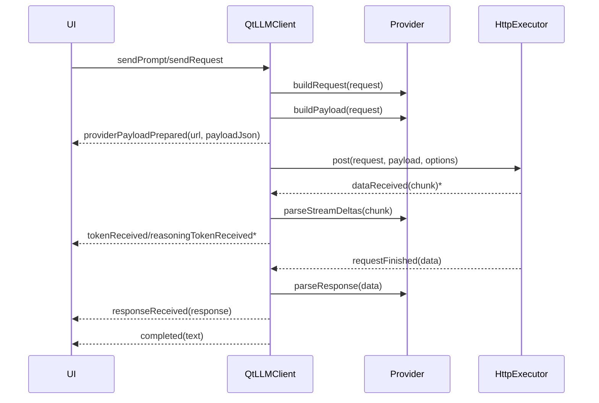
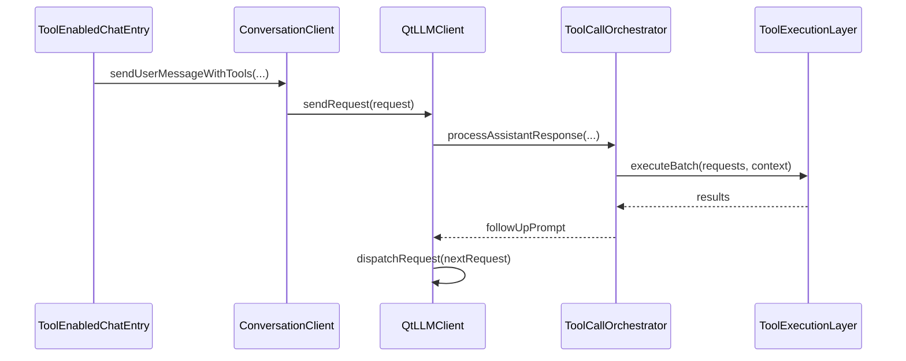

# `QtLLMClient`

## 1. 定位

`QtLLMClient` 是 `qtllm` 最核心的请求执行类。它负责：

- 管理当前 Provider
- 调用 `HttpExecutor` 发送请求
- 处理流式返回
- 输出最终响应
- 在配置了 `ToolCallOrchestrator` 时进入内部工具循环

如果把 `qtllm` 看成一个请求执行引擎，`QtLLMClient` 就是引擎主入口。

## 2. 头文件与命名空间

- 头文件：`src/qtllm/core/qtllmclient.h`
- 命名空间：`qtllm`

## 3. 接口签名总览

```cpp
void setConfig(const LlmConfig &config);
void setProvider(std::unique_ptr<ILLMProvider> provider);
bool setProviderByName(const QString &providerName);

void setToolCallOrchestrator(
    const std::shared_ptr<tools::runtime::ToolCallOrchestrator> &orchestrator);
void setToolLoopContext(const QString &clientId,
                        const QString &sessionId,
                        const QString &traceId = QString());

void sendPrompt(const QString &prompt);
void sendRequest(const LlmRequest &request);
void cancelCurrentRequest();
```

## 4. 关键相关类型

### `LlmConfig`

```cpp
struct LlmConfig {
    QString providerName;
    QString baseUrl;
    QString apiKey;
    QString model;
    QString modelVendor;
    bool stream = true;
    int timeoutMs = 60000;
    int maxRetries = 0;
    int retryDelayMs = 400;
};
```

字段说明：

- `providerName`
  - ProviderFactory 识别用名称
- `baseUrl`
  - 目标服务根地址
- `apiKey`
  - 鉴权信息
- `model`
  - 模型名称
- `modelVendor`
  - 模型族/厂商提示，工具协议路由时会使用
- `stream`
  - 是否流式输出
- `timeoutMs`
  - 请求超时
- `maxRetries`
  - 最大重试次数
- `retryDelayMs`
  - 重试间隔

### `LlmRequest`

```cpp
struct LlmRequest {
    QVector<LlmMessage> messages;
    QString model;
    bool stream = true;
    QJsonArray tools;
};
```

字段说明：

- `messages`
  - 发送给模型的消息窗口
- `model`
  - 可覆盖配置中的模型名
- `stream`
  - 可覆盖配置中的流式开关
- `tools`
  - Provider 可见 tools schema

## 5. 主要方法说明

### `setConfig(const LlmConfig &config)`

作用：

- 保存当前请求配置
- 如果 Provider 已存在，则把配置同步给 Provider

### `setProvider(std::unique_ptr<ILLMProvider> provider)`

作用：

- 手动注入 Provider 实现

适合：

- 自定义 Provider
- 测试替身 Provider

### `bool setProviderByName(const QString &providerName)`

作用：

- 通过 `ProviderFactory` 创建 Provider

返回值：

- `true`
  - 创建成功
- `false`
  - Provider 不支持或初始化失败，同时会发出 `errorOccurred`

### `setToolCallOrchestrator(...)`

作用：

- 配置工具循环编排器

说明：

- 基础聊天可不配置
- 使用 `ToolEnabledChatEntry` 时通常会自动接好

### `setToolLoopContext(const QString &clientId, const QString &sessionId, const QString &traceId = QString())`

作用：

- 绑定工具循环上下文

用途：

- 日志上下文
- `toolsinside` trace 记录
- 按 `clientId + sessionId` 维护 tool loop 状态

参数建议：

- `clientId`
  - 使用稳定业务 id 或 `ConversationClient::uid()`
- `sessionId`
  - 使用当前 active session id
- `traceId`
  - 一次用户输入对应一个 trace；不传会在发送阶段生成

### `sendPrompt(const QString &prompt)`

作用：

- 以最小方式发送一条用户 prompt

特点：

- 自动构造 `LlmRequest`
- 不带历史消息
- 适合最简接入

### `sendRequest(const LlmRequest &request)`

作用：

- 发送完整请求对象

适合：

- 自己构造 history
- 传入 tools schema
- 细粒度控制消息窗口

### `cancelCurrentRequest()`

作用：

- 调用 `HttpExecutor` 取消当前请求

注意：

- 已写入 UI 的流式 token 不会自动回滚

## 6. 信号

```cpp
void tokenReceived(const QString &token);
void reasoningTokenReceived(const QString &token);
void completed(const QString &text);
void responseReceived(const LlmResponse &response);
void errorOccurred(const QString &message);
void providerPayloadPrepared(const QString &url, const QString &payloadJson);
```

最常用用途：

- `tokenReceived`
  - 增量显示内容 token
- `reasoningTokenReceived`
  - 显示 reasoning 通道
- `responseReceived`
  - 读取结构化响应
- `completed`
  - 本轮请求结束
- `errorOccurred`
  - 错误处理
- `providerPayloadPrepared`
  - 调试最终 URL 和 payload

## 7. 请求生命周期

### 基础链路



`*` 表示流式模式下可能重复发生。

## 8. 与工具循环的关系

`QtLLMClient` 不负责“选择工具”，但负责“执行工具循环”。

当满足以下条件时会进入 tool loop：

1. 已设置 `ToolCallOrchestrator`
2. 已设置 `clientId` 和 `sessionId`
3. 模型返回了 tool calls 或可解析的工具调用文本



结论：

- `QtLLMClient` 是工具循环执行中心
- `ToolEnabledChatEntry` 是工具循环应用入口

## 9. 适用场景

适合：

- 最小聊天接入
- 单轮请求
- 自己维护完整 `LlmRequest` 的应用
- 调试 Provider 请求链路

不适合单独承担的场景：

- 多 session
- 自动拼接 history / profile
- 工具选择

这些场景应切换到：

- `ConversationClient`
- `ToolEnabledChatEntry`
