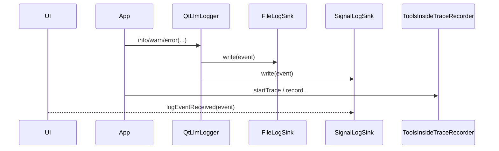

# 日志与链路观测

## 1. 两套观测系统

当前工程同时提供两套观测能力。

### `logging`

面向：

- 实时排障
- 运行日志查看
- UI 日志面板

主要类：

- `QtLlmLogger`
- `FileLogSink`
- `SignalLogSink`

### `toolsinside`

面向：

- trace 级分析
- 工具调用时间线
- artifact 存档
- request 与 tool output 还原

主要类：

- `ToolsInsideRuntime`
- `ToolsInsideTraceRecorder`
- `ToolsInsideQueryService`
- `ToolsInsideAdminService`

## 2. `QtLlmLogger`

- 头文件：`src/qtllm/logging/qtllmlogger.h`

### 接口签名

```cpp
class QtLlmLogger {
public:
    static QtLlmLogger &instance();

    void setMinimumLevel(LogLevel level);
    LogLevel minimumLevel() const;

    void addSink(const std::shared_ptr<ILogSink> &sink);
    void removeSink(const std::shared_ptr<ILogSink> &sink);
    void clearSinks();

    std::shared_ptr<FileLogSink> installFileSink(const FileLogSinkOptions &options);

    void log(LogLevel level,
             const QString &category,
             const QString &message,
             const LogContext &context = LogContext(),
             const QJsonObject &fields = QJsonObject());

    void trace(...);
    void debug(...);
    void info(...);
    void warn(...);
    void error(...);
};
```

### 相关类型

```cpp
enum class LogLevel { Trace, Debug, Info, Warn, Error };

struct LogContext {
    QString clientId;
    QString sessionId;
    QString requestId;
    QString traceId;
};

struct LogEvent {
    QDateTime timestampUtc;
    LogLevel level;
    QString category;
    QString message;
    QString clientId;
    QString sessionId;
    QString requestId;
    QString traceId;
    QString threadId;
    QJsonObject fields;
};
```

## 3. `FileLogSink`

- 头文件：`src/qtllm/logging/filelogsink.h`

```cpp
struct FileLogSinkOptions {
    QString workspaceRoot;
    qint64 maxBytesPerFile = 5 * 1024 * 1024;
    int maxFilesPerClient = 20;
    QString systemClientId = QStringLiteral("_system");
};

class FileLogSink : public ILogSink {
public:
    explicit FileLogSink(FileLogSinkOptions options = FileLogSinkOptions());
    void write(const LogEvent &event) override;
    void setOptions(const FileLogSinkOptions &options);
    FileLogSinkOptions options() const;
    QString logsRootPath() const;
};
```

典型落盘目录：

```text
.qtllm/logs/<clientId>/*.jsonl
```

## 4. `SignalLogSink`

- 头文件：`src/qtllm/logging/signallogsink.h`

```cpp
class SignalLogSink : public QObject, public ILogSink {
    Q_OBJECT
public:
    explicit SignalLogSink(QObject *parent = nullptr);
    void write(const LogEvent &event) override;

signals:
    void logEventReceived(const qtllm::logging::LogEvent &event);
};
```

适合：

- 窗口内实时日志面板
- 调试工具和 MCP 运行状态

## 5. `toolsinside` 运行时入口

### `ToolsInsideRuntime`

- 头文件：`src/qtllm/toolsinside/toolsinsideruntime.h`

```cpp
class ToolsInsideRuntime {
public:
    static ToolsInsideRuntime &instance();

    void configureWorkspaceRoot(const QString &workspaceRoot);
    QString workspaceRoot() const;

    void setStoragePolicy(const ToolsInsideStoragePolicy &policy);
    ToolsInsideStoragePolicy storagePolicy() const;

    void setRedactionPolicy(std::shared_ptr<IToolsInsideRedactionPolicy> redactionPolicy);
    const IToolsInsideRedactionPolicy &redactionPolicy() const;

    std::shared_ptr<ToolsInsideRepository> repository() const;
    std::shared_ptr<ToolsInsideArtifactStore> artifactStore() const;
    std::shared_ptr<ToolsInsideQueryService> queryService() const;
    std::shared_ptr<ToolsInsideAdminService> adminService() const;
    std::shared_ptr<ToolsInsideTraceRecorder> recorder() const;
};
```

### `ToolsInsideTraceRecorder`

关键方法：

- `startTrace(...)`
- `recordToolSelection(...)`
- `recordRequestPrepared(...)`
- `recordRequestDispatched(...)`
- `recordResponseParsed(...)`
- `recordToolCallsParsed(...)`
- `recordToolCallStarted(...)`
- `recordToolCallFinished(...)`
- `recordFollowUpPrompt(...)`
- `recordFailureGuard(...)`
- `recordTraceCompleted(...)`
- `recordTraceError(...)`

### `ToolsInsideQueryService`

- 头文件：`src/qtllm/toolsinside/toolsinsidequeryservice.h`

```cpp
QList<ToolsInsideClientSummary> listClients(QString *errorMessage = nullptr) const;
QList<ToolsInsideSessionSummary> listSessions(const QString &clientId, QString *errorMessage = nullptr) const;
QList<ToolsInsideTraceSummary> listTraces(const ToolsInsideTraceFilter &filter, QString *errorMessage = nullptr) const;
std::optional<ToolsInsideTraceSummary> getTraceSummary(const QString &traceId, QString *errorMessage = nullptr) const;
QList<ToolsInsideEventRecord> getTraceTimeline(const QString &traceId, QString *errorMessage = nullptr) const;
QList<ToolsInsideArtifactRef> getTraceArtifacts(const QString &traceId, QString *errorMessage = nullptr) const;
QList<ToolsInsideToolCallRecord> getTraceToolCalls(const QString &traceId, QString *errorMessage = nullptr) const;
QList<ToolsInsideSupportLink> getTraceSupportLinks(const QString &traceId, QString *errorMessage = nullptr) const;
ToolsInsideStorageStats getStorageStats(QString *errorMessage = nullptr) const;
```

### `ToolsInsideAdminService`

- 头文件：`src/qtllm/toolsinside/toolsinsideadminservice.h`

```cpp
bool archiveTrace(const QString &traceId, QString *errorMessage = nullptr) const;
bool purgeTrace(const QString &traceId, QString *errorMessage = nullptr) const;
```

## 6. 运行时观测链路



## 7. 什么时候看日志，什么时候看 trace

### 优先看日志

适合：

- Provider 没创建成功
- 网络错误
- 某次调用直接失败
- 需要在 UI 中实时显示状态

### 优先看 `toolsinside`

适合：

- 为什么模型调用了某个工具
- 工具执行了几轮
- follow-up prompt 内容是什么
- 最终回答前发生了哪些 request / tool batch

## 8. 运行时目录

### 日志目录

```text
.qtllm/logs/<clientId>/*.jsonl
```

### trace 目录

```text
.qtllm/tools_inside/
  index.db
  artifacts/
  archive/
```

## 9. 开发建议

- 普通应用至少安装 `FileLogSink`
- 带工具/MCP 的应用同时接入 `toolsinside`
- 对关键对象统一传递 `clientId`、`sessionId`、`requestId`、`traceId`
- UI 若要展示链路详情，优先读 `toolsinside`，不要自己重复维护一套 trace
