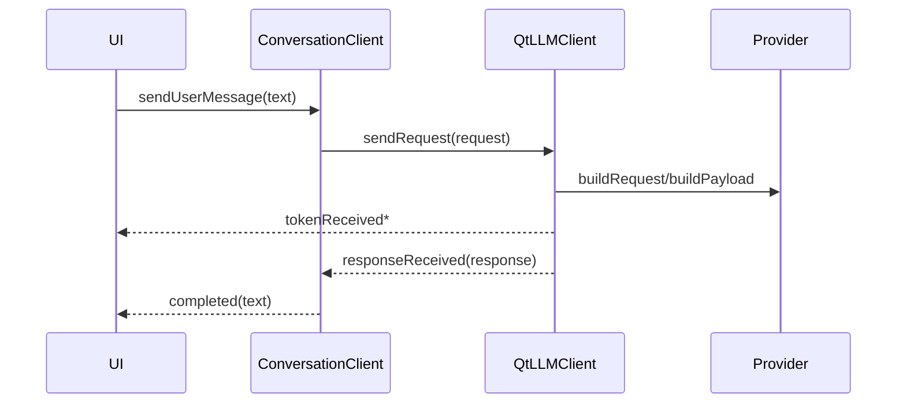

# 场景一：开发基础聊天应用

## 1. 目标

适用于：

- 单窗口聊天
- 不要求复杂 session 管理
- 不需要工具调用

## 2. 对象组合

最简组合：

- `QtLLMClient`
- `LlmConfig`
- 某个 `ILLMProvider`

更推荐的正式组合：

- `ConversationClient`
- `LlmConfig`
- `QtLlmLogger`（可选）

## 3. 开发步骤

### 步骤 1：准备配置

需要：

- `providerName`
- `baseUrl`
- `model`
- `apiKey`（如需要）

### 步骤 2：创建客户端

```cpp
auto client = QSharedPointer<qtllm::chat::ConversationClient>::create(
    QStringLiteral("main-chat"));
client->setConfig(config);
client->setProviderByName(config.providerName);
```

### 步骤 3：连接信号

推荐连接：

- `tokenReceived`
- `completed`
- `errorOccurred`
- `providerPayloadPrepared`

### 步骤 4：发送消息

```cpp
client->sendUserMessage(userInput);
```

## 4. 运行时时序



## 5. UI 实现建议

- 发送前禁用发送按钮
- `tokenReceived` 用于渐进刷新输出区
- `completed` 用于解锁按钮和落定最终文本
- `errorOccurred` 用于状态栏或弹窗提示

## 6. 常见增强点

- 想恢复历史：接 `ConversationRepository`
- 想多话题：使用 `createSession(...)`
- 想排障：安装 `FileLogSink`
