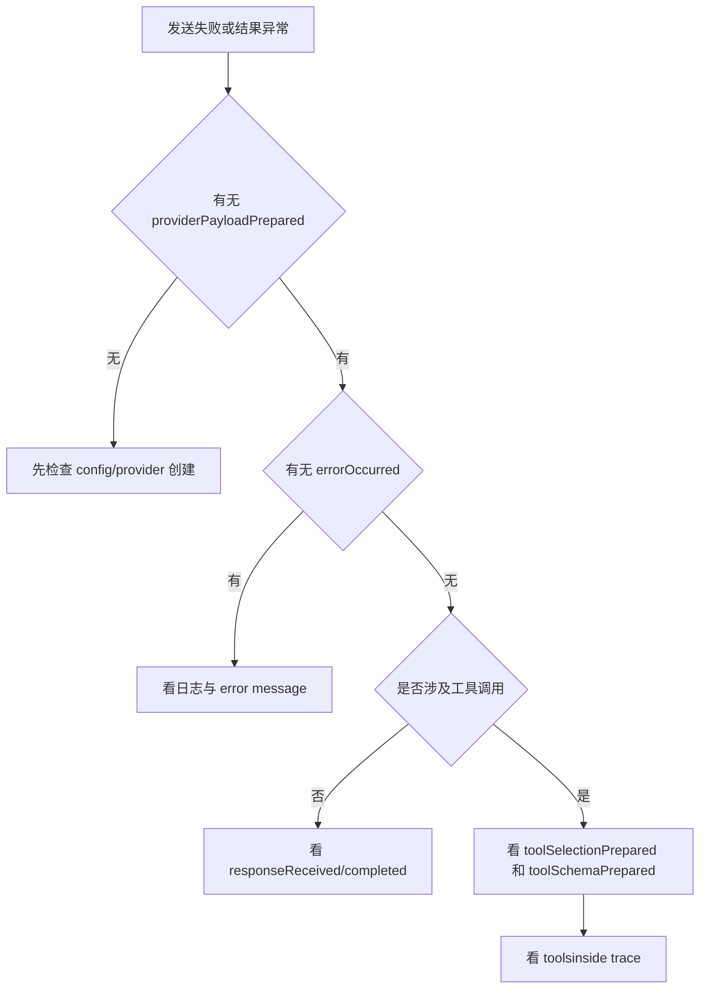

# 场景五：开发期排障与观测

## 1. 目标

本页回答：

- 请求没有发出去时看什么
- 响应不对时看什么
- 工具调用异常时看什么
- MCP 异常时看什么

## 2. 排障分层

推荐顺序：

1. 信号
2. Provider payload
3. 文件日志
4. `toolsinside` trace

## 3. 常用信号

### 请求层

- `requestPrepared`
- `providerPayloadPrepared`

### 响应层

- `tokenReceived`
- `reasoningTokenReceived`
- `responseReceived`
- `completed`
- `errorOccurred`

### 工具层

- `toolSelectionPrepared`
- `toolSchemaPrepared`

## 4. 排障流程图

## 5. 常见问题与检查顺序

### 发送后没有任何响应

先检查：

1. `setProviderByName(...)` 是否成功
2. `providerPayloadPrepared` 是否发出
3. `errorOccurred` 是否已报错
4. 文件日志中是否有 `llm.request`

### 模型返回了，但 UI 没显示

先检查：

1. 是否连接了 `tokenReceived` 或 `completed`
2. 是否只处理了 `completed` 但启用了流式输出
3. UI 是否意外清空了缓冲内容

### 模型没调用工具

先检查：

1. `toolSelectionPrepared` 中是否选中了目标工具
2. `toolSchemaPrepared` 中是否包含目标工具
3. `providerPayloadPrepared` 中 payload 是否真的带了 tools

### 模型调用了工具，但执行失败

先检查：

1. `ToolExecutionLayer` 日志
2. client policy 是否禁止
3. built-in 执行器是否存在
4. MCP server 是否存在且 enabled

### 最终答案不对

先检查：

1. `toolsinside` timeline
2. tool call 结果
3. follow-up prompt
4. final answer artifact

## 6. 建议的开发期配置

- 安装 `FileLogSink`
- UI 保留 payload 查看入口
- 带工具的应用接入 `toolsinside`
- 统一透传 `clientId`、`sessionId`、`requestId`、`traceId`
