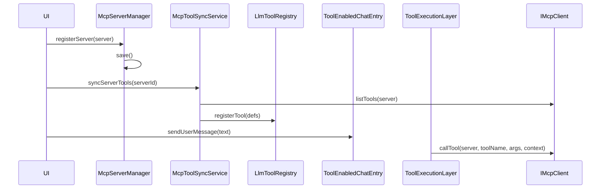

# 场景四：开发 MCP 宿主应用

## 1. 目标

适用于：

- 需要管理 MCP server
- 需要同步外部工具
- 需要让聊天能力消费这些工具

## 2. 对象组合

- `McpServerManager`
- `McpToolSyncService`
- `IMcpClient`
- `LlmToolRegistry`
- `ToolEnabledChatEntry`

## 3. 开发步骤

### 步骤 1：创建 `McpServerManager`

```cpp
auto manager = std::make_shared<qtllm::tools::mcp::McpServerManager>();
manager->load();
```

### 步骤 2：让用户管理 server

典型操作：

- register
- update
- remove
- list

### 步骤 3：同步远端工具

```cpp
qtllm::tools::mcp::McpToolSyncService sync(registry, manager->registry(), mcpClient);
sync.syncServerTools(serverId);
```

### 步骤 4：把 MCP 能力接到执行层

```cpp
executionLayer->setMcpClient(mcpClient);
executionLayer->setMcpServerRegistry(manager->registry());
```

### 步骤 5：像普通工具应用一样发送消息

```cpp
entry->sendUserMessage(userInput);
```

## 4. 运行时时序



## 5. UI 功能建议

- server 列表
- server 详情
- tools/resources/prompts 能力查看
- 同步按钮
- 带 MCP 的聊天窗口

## 6. 最适合参考的现有应用

- `src/apps/mcp_server_manager/`
