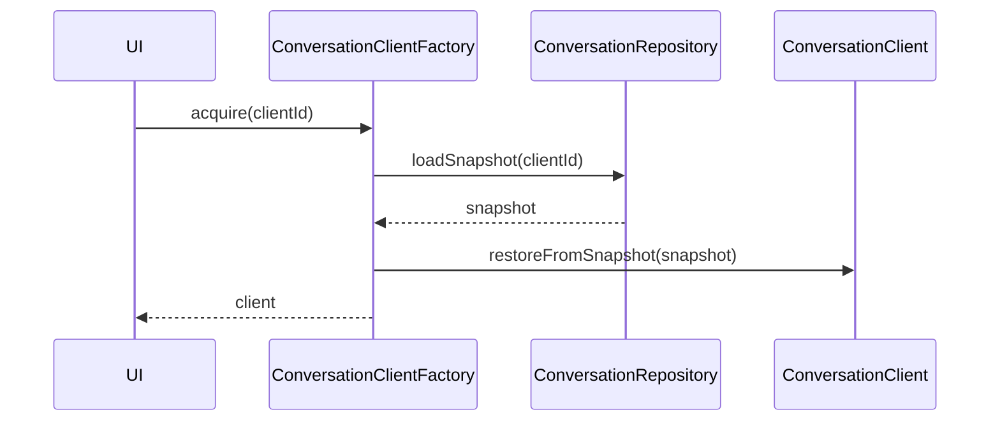

# 场景二：开发多会话应用

## 1. 目标

适用于：

- 一个应用里管理多个 client
- 每个 client 下有多个 session
- 下次启动需要自动恢复

## 2. 对象组合

- `ConversationRepository`
- `ConversationClientFactory`
- 多个 `ConversationClient`

## 3. 开发步骤

### 步骤 1：创建 repository

```cpp
auto repository = std::make_shared<qtllm::storage::ConversationRepository>(
    QStringLiteral(".qtllm/clients"));
```

### 步骤 2：创建 factory

```cpp
auto *factory = new qtllm::chat::ConversationClientFactory(this);
factory->setRepository(repository);
```

### 步骤 3：按 `clientId` 获取 client

```cpp
auto assistantClient = factory->acquire(QStringLiteral("assistant-main"));
auto plannerClient = factory->acquire(QStringLiteral("planner"));
```

### 步骤 4：分别设置 config / profile

### 步骤 5：管理 session

```cpp
assistantClient->createSession(QStringLiteral("项目讨论"));
assistantClient->switchSession(sessionId);
```

## 4. 启动恢复时序



## 5. 运行时保存链路

```text
historyChanged / sessionsChanged / configChanged / profileChanged
  -> ConversationClientFactory::saveClient
  -> ConversationRepository::saveSnapshot
```

## 6. UI 设计建议

- 左侧 client 列表
- 中间 session 列表
- 右侧当前 session 对话区

推荐监听：

- `sessionsChanged`
- `activeSessionChanged`
- `historyChanged`

## 7. 最适合参考的现有应用

- `src/apps/multi_client_chat/`
