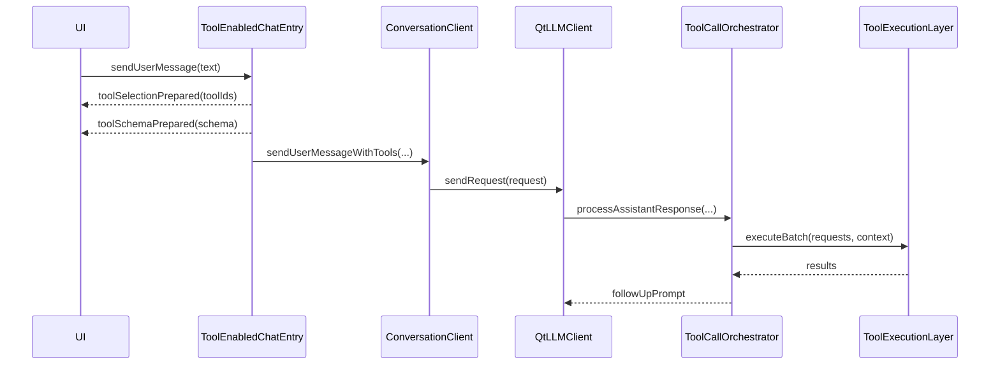

# 场景三：开发带工具调用的应用

## 1. 目标

适用于：

- 模型需要调用本地工具
- 需要把工具显式暴露给模型
- 未来还会接入 MCP 工具

## 2. 对象组合

- `ConversationClient`
- `ToolEnabledChatEntry`
- `LlmToolRegistry`
- `ToolExecutionLayer`
- `ToolCallOrchestrator`

## 3. 开发步骤

### 步骤 1：准备 `ConversationClient`

### 步骤 2：准备共享 `LlmToolRegistry`

```cpp
auto registry = std::make_shared<qtllm::tools::LlmToolRegistry>();
```

### 步骤 3：创建 `ToolEnabledChatEntry`

```cpp
auto *entry = new qtllm::tools::ToolEnabledChatEntry(client, registry, this);
```

### 步骤 4：按需替换执行层与策略

- `setExecutionLayer(...)`
- `setClientPolicyRepository(...)`
- `setToolSelectionLayer(...)`

### 步骤 5：连接信号

- `toolSelectionPrepared`
- `toolSchemaPrepared`
- `tokenReceived`
- `completed`
- `errorOccurred`

### 步骤 6：发送消息

```cpp
entry->sendUserMessage(userInput);
```

## 4. 运行时时序



## 5. built-in 工具与 MCP 工具的区别

### built-in 工具

- 本地注册
- 走本地执行器

### MCP 工具

- 从 MCP server 导入
- 进入共享 `LlmToolRegistry`
- 执行时走 `IMcpClient`

## 6. 排障顺序

1. `toolSelectionPrepared`
2. `toolSchemaPrepared`
3. `providerPayloadPrepared`
4. `QtLlmLogger`
5. `toolsinside`
