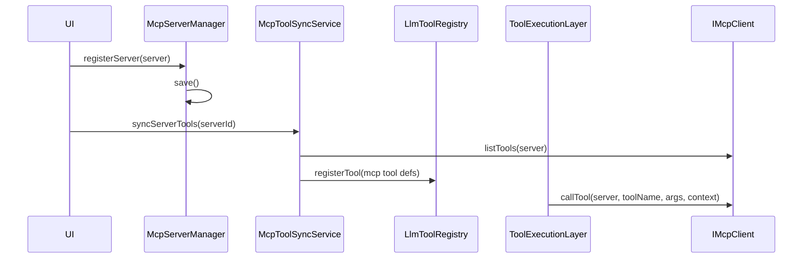

# MCP 集成

## 1. 定位

在当前工程中，MCP 不是单独聊天系统，而是共享工具体系的一部分。

这意味着：

- MCP server 提供外部工具
- 工具进入共享 `LlmToolRegistry`
- 模型仍然通过统一 tool loop 调用它们

## 2. 关键类

### `McpServerManager`

作用：

- 对外提供 MCP server 增删改查与持久化管理

接口签名：

```cpp
bool load(QString *errorMessage = nullptr);
bool save(QString *errorMessage = nullptr) const;

bool registerServer(const McpServerDefinition &server, QString *errorMessage = nullptr);
bool updateServer(const McpServerDefinition &server, QString *errorMessage = nullptr);
bool removeServer(const QString &serverId, QString *errorMessage = nullptr);

QVector<McpServerDefinition> allServers() const;
std::optional<McpServerDefinition> find(const QString &serverId) const;

std::shared_ptr<McpServerRegistry> registry() const;
```

### `McpServerRegistry`

负责：

- 管理内存中的 MCP server 定义

### `McpServerRepository`

负责：

- 把 server 定义写入 `.qtllm/mcp/servers.json`

### `McpToolSyncService`

负责：

- 从 MCP server 拉取工具定义
- 转成 `LlmToolDefinition`
- 注册到共享 `LlmToolRegistry`

### `IMcpClient` / `DefaultMcpClient`

负责：

- 执行 MCP 协议调用
- 当前支持 `stdio`、`streamable-http`、`sse`

## 3. `McpServerDefinition`

```cpp
struct McpServerDefinition {
    QString serverId;
    QString name;
    QString transport = QStringLiteral("stdio");
    bool enabled = true;
    QString command;
    QStringList args;
    QJsonObject env;
    QString url;
    QJsonObject headers;
    int timeoutMs = 30000;
};
```

字段说明：

- `serverId`
  - 唯一标识
- `name`
  - 显示名
- `transport`
  - `stdio | streamable-http | sse`
- `enabled`
  - 是否启用
- `command/args/env`
  - `stdio` 模式配置
- `url/headers`
  - HTTP/SSE 模式配置
- `timeoutMs`
  - 单次调用超时

## 4. 接入流程

### 第一步：创建并加载 server 管理器

```cpp
auto manager = std::make_shared<qtllm::tools::mcp::McpServerManager>();
manager->load();
```

### 第二步：注册或恢复 server

持久化位置：

- `.qtllm/mcp/servers.json`

### 第三步：同步远端工具

```cpp
qtllm::tools::mcp::McpToolSyncService sync(registry, manager->registry(), mcpClient);
sync.syncServerTools(serverId);
```

### 第四步：把 MCP 能力接到执行层

```cpp
executionLayer->setMcpClient(mcpClient);
executionLayer->setMcpServerRegistry(manager->registry());
```

## 5. MCP 工具如何进入共享工具体系

`McpToolSyncService` 会把远端工具转换为：

- `toolId = mcp::<serverId>::<toolName>`
- `invocationName = mcp_<server>_<tool>`
- `category = mcp`

然后注册到共享 `LlmToolRegistry`。

## 6. MCP 工具如何执行



运行时步骤：

1. `ToolExecutionLayer` 检查 `toolId`
2. 若前缀为 `mcp::`，拆出 `serverId` 和 `toolName`
3. 从 `McpServerRegistry` 找到目标 server
4. 调用 `IMcpClient::callTool(...)`

## 7. 典型开发顺序

1. 准备 `ConversationClient`
2. 准备 `LlmToolRegistry`
3. 创建 `McpServerManager`
4. 加载或注册 MCP server
5. 用 `McpToolSyncService` 同步工具
6. 创建 `ToolEnabledChatEntry`
7. 把 MCP client 和 registry 注入执行层
