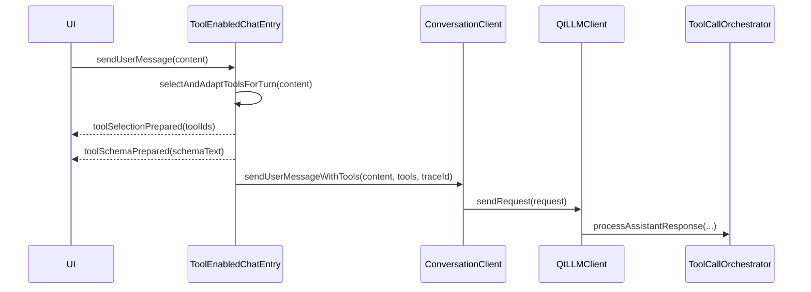

# `ToolEnabledChatEntry`

## 1. 定位

`ToolEnabledChatEntry` 是应用侧接入工具调用能力的推荐入口。

它位于：

- `ConversationClient` 之上
- `ToolCallOrchestrator`、`ToolExecutionLayer` 之前

它负责：

- 为当前用户输入选择工具
- 把工具定义转换为 Provider 可见 schema
- 把工具循环所需依赖接到 `ConversationClient`

## 2. 头文件与命名空间

- 头文件：`src/qtllm/tools/toolenabledchatentry.h`
- 命名空间：`qtllm::tools`

## 3. 构造方式

```cpp
auto client = factory->acquire(QStringLiteral("assistant-main"));
auto registry = std::make_shared<qtllm::tools::LlmToolRegistry>();
auto *entry = new qtllm::tools::ToolEnabledChatEntry(client, registry, this);
```

构造参数：

- `ConversationClient`
  - 提供 history、profile、session
- `LlmToolRegistry`
  - 提供当前所有可见工具目录

## 4. 接口签名总览

```cpp
void sendUserMessage(const QString &content);

void setToolSelectionLayer(ToolSelectionLayer selectionLayer);
void setToolAdapter(std::unique_ptr<ILlmToolAdapter> adapter);

void setExecutionLayer(
    const std::shared_ptr<runtime::ToolExecutionLayer> &executionLayer);
void setClientPolicyRepository(
    const std::shared_ptr<runtime::ClientToolPolicyRepository> &policyRepository);
void setMcpClient(const std::shared_ptr<mcp::IMcpClient> &mcpClient);
void setMcpServerRegistry(
    const std::shared_ptr<mcp::McpServerRegistry> &serverRegistry);
void setTraceContext(const QString &requestId, const QString &traceId);

QList<runtime::ToolExecutionResult> executeToolCalls(
    const QList<runtime::ToolCallRequest> &requests);
```

## 5. 主要方法说明

### `sendUserMessage(const QString &content)`

内部行为：

1. 重置当前 session 的 tool loop 状态
2. 创建新的 `traceId`
3. 在 `toolsinside` 中启动 trace
4. 选择工具
5. 生成 tools schema
6. 调用 `ConversationClient::sendUserMessageWithTools(...)`

### `setToolSelectionLayer(...)`

作用：

- 替换默认工具选择策略

### `setToolAdapter(...)`

作用：

- 替换 tools schema 适配器

### `setExecutionLayer(...)`

作用：

- 配置实际工具执行层

注意：

- 会同步给内部 `ToolCallOrchestrator`
- 会把共享 `LlmToolRegistry` 注入执行层

### `setClientPolicyRepository(...)`

作用：

- 为当前 client 提供工具权限策略

### `setMcpClient(...)` / `setMcpServerRegistry(...)`

作用：

- 接入 MCP 执行依赖

### `executeToolCalls(...)`

作用：

- 直接执行一批工具请求

适合：

- 测试
- 自定义工具面板
- 绕过模型直接调工具

## 6. 信号

```cpp
void tokenReceived(const QString &token);
void reasoningTokenReceived(const QString &token);
void completed(const QString &text);
void errorOccurred(const QString &message);
void toolSelectionPrepared(const QStringList &toolIds);
void toolSchemaPrepared(const QString &schemaText);
```

## 7. 一次调用的完整链路



## 8. 与 `ConversationClient` 的关系

`ConversationClient` 负责：

- 会话
- profile
- history
- request 组织

`ToolEnabledChatEntry` 负责：

- 工具选择
- schema 适配
- 工具编排入口

结论：

- 没有工具需求时，可以只有 `ConversationClient`
- 有工具需求时，应在外层包一层 `ToolEnabledChatEntry`
