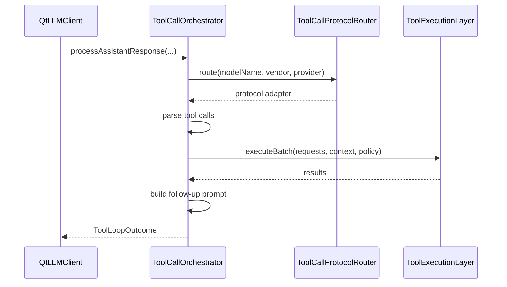

# Tool Runtime

## 1. 定位

`tools/runtime` 负责工具调用的核心运行时逻辑。它不是单一类，而是一组协作类：

- 工具目录
- 工具选择
- 工具协议适配
- 工具调用解析
- 工具执行
- 失败保护

## 2. 关键类总览

### `LlmToolDefinition`

canonical 定义，最重要的三个标识：

- `toolId`
  - 内部唯一标识
- `invocationName`
  - 发给模型的函数名
- `name`
  - UI 展示名

### `LlmToolRegistry`

负责：

- 管理当前所有工具
- 合并 built-in 工具与 MCP 工具

### `ToolSelectionLayer`

负责：

- 从可用工具中选出本轮暴露给模型的候选集

### `ToolCallProtocolRouter`

负责：

- 根据 `modelName`、`modelVendor`、`providerName` 决定采用哪种 tool call 协议解析器

## 3. `ToolCallOrchestrator`

头文件：`src/qtllm/tools/runtime/toolcallorchestrator.h`

接口签名：

```cpp
void setExecutionLayer(const std::shared_ptr<ToolExecutionLayer> &executionLayer);
void setPolicyRepository(const std::shared_ptr<ClientToolPolicyRepository> &policyRepository);

void setMaxConsecutiveFailures(int maxConsecutiveFailures);
void setMaxRounds(int maxRounds);

void resetSession(const QString &clientId, const QString &sessionId);

ToolLoopOutcome processAssistantMessage(const QString &modelName,
                                       const QString &modelVendor,
                                       const QString &providerName,
                                       const QString &assistantText,
                                       const ToolExecutionContext &context) const;

ToolLoopOutcome processAssistantResponse(const QString &modelName,
                                        const QString &modelVendor,
                                        const QString &providerName,
                                        const LlmResponse &response,
                                        const ToolExecutionContext &context) const;
```

`ToolLoopOutcome` 最重要字段：

- `hasFollowUpPrompt`
- `followUpPrompt`
- `terminatedByFailureGuard`
- `consecutiveFailures`
- `roundIndex`

它解决的问题：

- 从模型响应中解析 tool calls
- 触发工具执行
- 管理多轮 tool loop
- 在失败过多时终止循环

## 4. `ToolExecutionLayer`

头文件：`src/qtllm/tools/runtime/toolexecutionlayer.h`

接口签名：

```cpp
void setRegistry(const std::shared_ptr<ToolExecutorRegistry> &registry);
void setToolRegistry(const std::shared_ptr<tools::LlmToolRegistry> &toolRegistry);
void setPolicy(const ToolExecutionPolicy &policy);
void setHooks(const std::shared_ptr<ToolRuntimeHooks> &hooks);
void setDryRunFailureMode(bool enabled);

void setMcpClient(const std::shared_ptr<mcp::IMcpClient> &mcpClient);
void setMcpServerRegistry(const std::shared_ptr<mcp::McpServerRegistry> &serverRegistry);

QList<ToolExecutionResult> executeBatch(const QList<ToolCallRequest> &requests,
                                        const ToolExecutionContext &context,
                                        const ClientToolPolicy &clientPolicy = ClientToolPolicy()) const;
```

### 关键相关类型

`ToolExecutionContext`：

```cpp
struct ToolExecutionContext {
    QString clientId;
    QString sessionId;
    profile::ClientProfile profile;
    LlmConfig llmConfig;
    QVector<LlmMessage> historyWindow;
    QString requestId;
    QString traceId;
    QJsonObject extra;
};
```

`ToolCallRequest`：

```cpp
struct ToolCallRequest {
    QString callId;
    QString toolId;
    QJsonObject arguments;
    QString idempotencyKey;
};
```

`ToolExecutionResult`：

```cpp
struct ToolExecutionResult {
    QString callId;
    QString toolId;
    bool success = false;
    QJsonObject output;
    QString errorCode;
    QString errorMessage;
    qint64 durationMs = 0;
    bool retryable = false;
};
```

### 如何区分工具来源

执行前先看 `toolId`：

- built-in 工具
  - 走 `ToolExecutorRegistry`
- `mcp::<serverId>::<toolName>`
  - 走 `IMcpClient`

### 权限控制

执行前会结合：

- `ClientToolPolicy`
- `ToolExecutionPolicy`

`ClientToolPolicy` 典型字段：

- `mode = all | allowlist | denylist`
- `allowIds`
- `denyIds`
- `maxToolsPerTurn`

## 5. 一轮 tool loop 的详细流程



对应文本流程：

1. 解析模型返回的工具调用
2. 根据 client policy 过滤
3. 执行工具批次
4. 统计失败数
5. 若未触发 failure guard，则生成 follow-up prompt
6. 交回 `QtLLMClient` 继续下一轮请求

## 6. 典型接线顺序

```cpp
auto registry = std::make_shared<qtllm::tools::LlmToolRegistry>();
auto executionLayer = std::make_shared<qtllm::tools::runtime::ToolExecutionLayer>();
executionLayer->setToolRegistry(registry);

auto orchestrator = std::make_shared<qtllm::tools::runtime::ToolCallOrchestrator>();
orchestrator->setExecutionLayer(executionLayer);

client->setToolCallOrchestrator(orchestrator);
```

更推荐：

- 由 `ToolEnabledChatEntry` 统一接线
